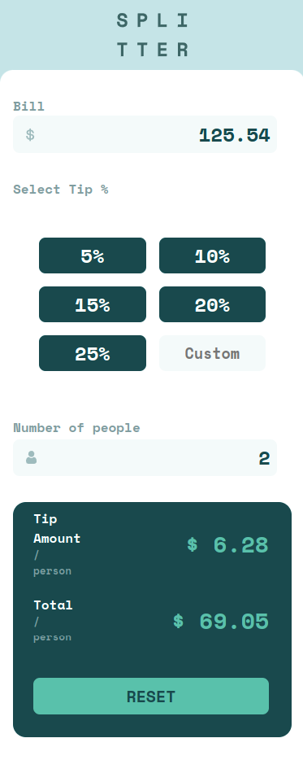

# Tip calculator app solution

## Table of contents

  - [Overview](#overview)
  - [Screenshot](#screenshot)
  - [Links](#links)
  - [My process](#my-process)
  - [Built with](#built-with)
  - [What I learned](#what-i-learned)
  - [Author](#author)

## Overview

This Tip Calculator should determine the tip amount and the total check per person based on suggested percentages besides a custom input to write larger amounts.

Users should be able to:

- View the optimal layout for the app depending on their device's screen size
- See hover states for interactive elements on the page
- Calculate the correct tip and total cost of the bill per person

### Screenshot

### Links

- Live Site URL:(https://sweet-marigold-272dfa.netlify.app/)

## My process

### Built with

- Semantic HTML5 markup
- CSS custom properties
- Flexbox
- CSS Grid
- Mobile-first workflow

### What I learned

I've learned a little bit more about CSS Grid in this project and in the Javascript part I've learned more about event listeners and how to use a event listener for multiple selectors like the buttons in the calculator.

## Author

- Twitter - (https://www.twitter.com/@fernandu00)

